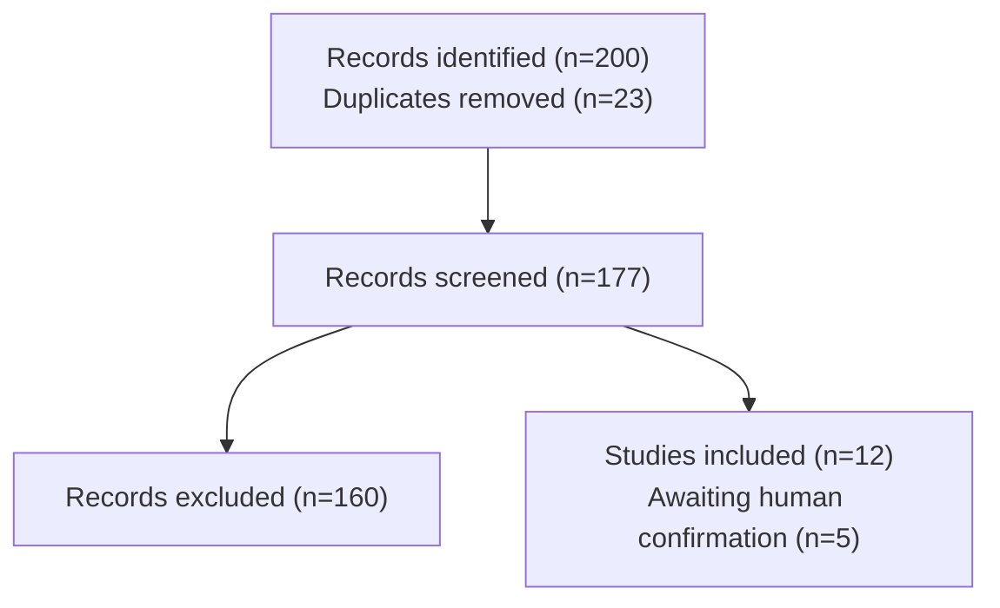

```mermaid
flowchart TD
  ID["Records identified (n=200)<br/>Duplicates removed (n=23)"]
  SC["Records screened (n=177)"]
  EX["Records excluded (n=160)"]
  IN["Studies included (n=12)<br/>Awaiting human confirmation (n=5)"]
  ID --> SC
  SC --> EX
  SC --> IN
```

| 环节 | n |
|---|---|
| identified | 200 |
| duplicates_removed | 23 |
| screened | 177 |
| excluded | 160 |
| included | 12 |
| needs_human | 5 |
